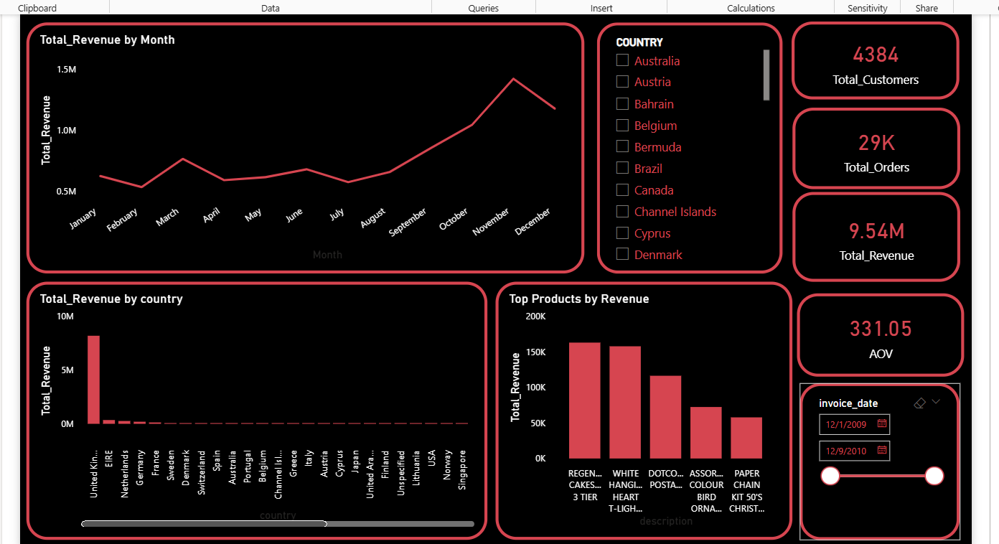
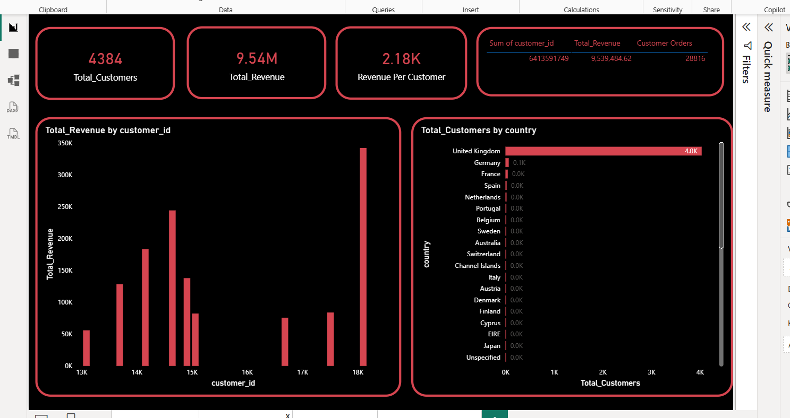
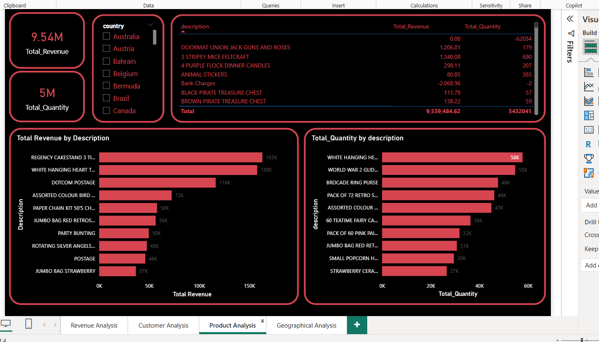
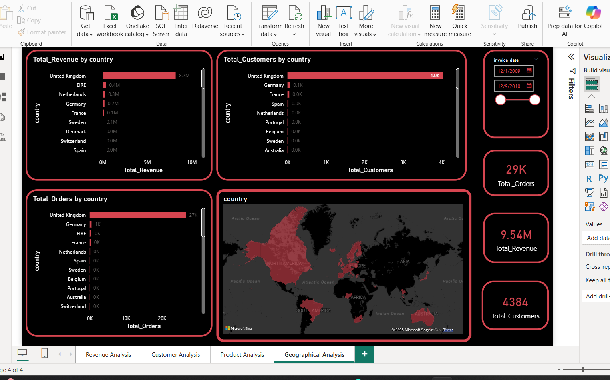

# Retail Sales Analytics Dashboard

## Project Overview

This project analyzes retail transaction data using SQL, PostgreSQL, Power BI, and DAX to uncover sales trends, customer behavior, product performance, and geographic insights.

The objective was to transform raw transactional data into interactive dashboards and actionable business insights.

---

## Tools & Technologies

* SQL
* PostgreSQL
* Power BI
* DAX
* Power Query

---

## Key KPIs

* Total Revenue
* Total Orders
* Total Customers
* Average Order Value (AOV)
* Revenue per Customer

---

## Dashboard Pages

### Revenue Analysis

* Revenue trend by month
* Revenue by country
* Top products by revenue

### Customer Analysis

* Top customers by revenue
* Customer order analysis
* Revenue per customer

### Product Analysis

* Top products by revenue
* Top products by quantity sold
* Product performance comparison

### Geographic Analysis

* Revenue by country
* Customers by country
* Orders by country
* Geographic sales distribution

---

## Key Insights

* United Kingdom generated the highest revenue and customer volume.
* Revenue peaked during November and December, indicating seasonal demand.
* Regency Cake Stand 3 Tier was the highest revenue-generating product.
* A small group of customers contributed a significant portion of total revenue.

---

## Project Workflow

Data Collection → Data Cleaning → SQL Analysis → KPI Creation → Power BI Dashboard Development → Business Insights

---

## Dashboard Preview

## Dashboard Preview

### Revenue Analysis

### Customer Analysis

### Product Analysis

### Geographic Analysis

